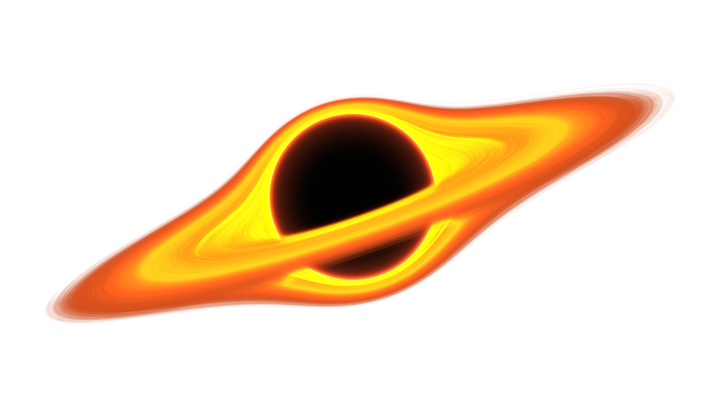

<h1 align="center">
    
    <h1 align="center" style="font-style:italic;">Black Charge</h1>
    <h5 align="center">
    <i style="color:grey;"> A particle launcher simulator </i>
    </h5>

</h1>

Made with [VueJS](https://vuejs.org/)

🔴 **Live View:** [***Here***](https://danielrasho.github.io/BlackCharge/)

🔴 **Video Demostration:** [***Here***](https://youtu.be/SAvX03AomgI)

Made with <3 by

- Flavio Galan
- Daniel Rayo

🔴 **Known Bugs:** 

- Crash when reloading the page.

## Compiling the project

All developer dependencies are defined on the shell.nix file. To use this file just install Nix and then proceed with the command:

```bash
nix-shell
```

All terminal command blocks assume your on the base directory of this repo and that you are inside the developer session that the command above creates.

This command will read the nix file and setup everything that you'll need to develop the app. Everytime you wish to compile the app you'll need to enter this command to have access to all the dev-tools.

The first time you execute the command it may take a while because it needs to install node.

Run this command within `/frontend` folder:

```bash
yarn dev
```

Then copy the URL showed in the terminal in a browser tab, and you are ready for start developing!
